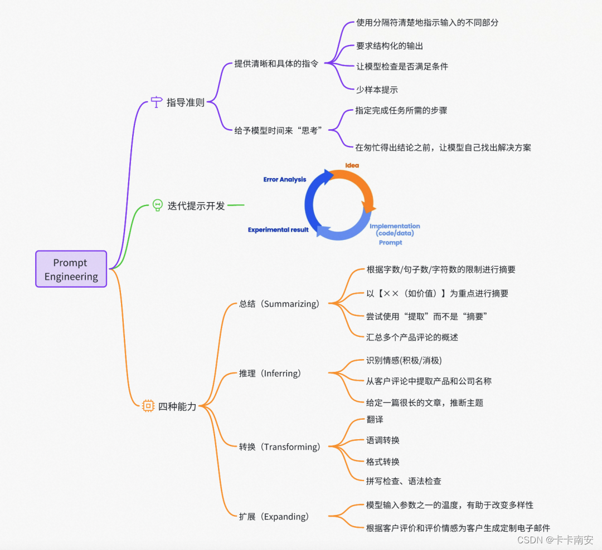

# llm-Initial-learning（https://datawhalechina.github.io/llm-universe/）

## LLM介绍
LLM 通常指包含**数百亿（或更多）参数的语言模型**，它们在海量的文本数据上进行训练，从而获得对语言深层次的理解。  
### 常见的LLM模型
> 闭源：GPT系列，CLAUDE系列，PaLM/Gemini 系列以及国内的一系列大模型  
> 开源：LLaMA 系列，通义千问，GLM 系列，Baichuan 系列

### RAG
RAG 是一个完整的系统，其工作流程可以简单地分为数据处理、检索、增强和生成四个阶段

### LangChain
**LangChain 框架是一个开源工具，充分利用了大型语言模型的强大能力，以便开发各种下游应用。它的目标是为各种大型语言模型应用提供通用接口，从而简化应用程序的开发流程**。具体来说，LangChain 框架可以实现数据感知和环境互动，也就是说，它能够让语言模型与其他数据来源连接，并且允许语言模型与其所处的环境进行互动。

### LLM项目的一般流程
> 步骤一：项目规划与需求分析  
> 确定项目目标和核心功能；确定技术架构和工具  
> 步骤二：数据准备与向量知识库构建  
> 如：加载本地文档 -> 读取文本 -> 文本分割 -> 文本向量化 -> question 向量化 -> 在文本向量中匹配出与问句向量最相似的 top k 个 -> 匹配出的文本作为上下文和问题一起添加到 Prompt 中 -> 提交给 LLM 生成回答。 
> 步骤三：大模型集成与 API 连接  
> 步骤四：核心功能实现  
> 步骤五：核心功能迭代优化  
> 步骤六：前端与用户交互界面开发  
> 步骤七：部署测试与上线  
> 步骤八：维护与持续改进  


## 使用LLM API开发应用

### 基本概念

#### Prompt（写一个prompt给大模型用于不断优化prompt？）

> 一种输入模板，可以减少模型幻觉，提高模型的输出质量

一个完整的Prompt包括以下几个关键要素：

1. **明确目标**：清晰定义任务，以便模型理解。
2. **具体指导**：给予模型明确的指导和约束。
3. **简洁明了**：使用简练、清晰的语言表达Prompt。
4. **适当引导**：通过示例或问题边界引导模型。
5. **迭代优化**：根据输出结果，持续调整和优化Prompt。

一些有效做法：

- 强调，可以适当的重复命令和操作。
- 给模型一个出路，如果模型可能无法完成,告诉它说“不知道”，别让它乱“联想”。
- 尽量具体，它还是孩子，少留解读空间。



**另**：

> [!NOTE]
>
> 1. **System Prompt** : 该种 Prompt 内容会在整个会话过程中持久地影响模型的回复，且相比于普通 Prompt 具有更高的重要性
> 2. **User Prompt**:  平常的Prompt

```json
{
    "system prompt": "你是一个幽默风趣的个人知识库助手，可以根据给定的知识库内容回答用户的提问，注意，你的回答风格应是幽默风趣的",
    "user prompt": "我今天有什么事务？"
}
```


#### Temperature

> 通过控制 temperature 参数来控制 LLM 生成结果的随机性与创造性。
>
> Temperature 一般取值在 0~1 之间，当取值较低接近 **0** 时，预测的随机性会较低，产生更**保守**、可预测的文本，不太可能生成意想不到或不寻常的词。当取值较高接近 **1** 时，预测的随机性会**较高**，所有词被选择的可能性更大，会产生更有**创意**、多样化的文本，更有可能生成不寻常或意想不到的词。


### API开发

####  智谱API（送的太多了）

```python
from zhipuai import ZhipuAI

client = ZhipuAI(
    api_key=os.environ["ZHIPUAI_API_KEY"]
)

def gen_glm_params(prompt):
    '''
    构造 GLM 模型请求参数 messages

    请求参数：
        prompt: 对应的用户提示词
    '''
    messages = [{"role": "user", "content": prompt}]
    return messages


def get_completion(prompt, model="glm-3-turbo", temperature=0.95):

    messages = gen_glm_params(prompt)
    response = client.chat.completions.create(
        model=model,
        messages=messages,
        temperature=temperature
    )
    if len(response.choices) > 0:
        return response.choices[0].message.content
    return "generate answer error"
```


## 搭建知识库

### 词向量及向量知识库

> [!Note]
>
> 在机器学习和自然语言处理（NLP）中，词向量（Embeddings）是一种将非结构化数据，如单词、句子或者整个文档，转化为实数向量的技术。这些实数向量可以被计算机更好地理解和处理。

- 词向量更容易检索
- 词向量的综合信息能力更强

**已知词向量可以捕捉语义，那么词向量可以捕捉跨语言的语义么？**

> 跨语言词向量（Cross-lingual Word Embeddings）旨在将不同语言中的词映射到同一个向量空间中，从而使不同语言之间的词能够相互对应。这可以通过以下几种方法来实现：
>
> - **直接投影**：这种方法将一种语言中的词向量直接投影到另一种语言的向量空间中。
> - **平行学习**：这种方法使用相同的词向量模型来训练不同语言的词向量。
> - **监督学习**：这种方法使用带有标签的对齐数据来训练跨语言词向量。
>
> 跨语言词向量已被应用于各种NLP任务中，例如：
>
> - **机器翻译**：跨语言词向量可以用于提高机器翻译的准确性。例如，通过使用跨语言词向量，机器翻译系统可以更好地理解源语言和目标语言之间的词之间的语义关系，从而生成更准确的译文。
> - **文本挖掘**：跨语言词向量可以用于在不同语言的文本中发现模式和趋势。例如，通过使用跨语言词向量，我们可以比较不同语言中的舆论情绪。
> - **信息检索**：跨语言词向量可以用于提高跨语言信息检索的准确性。例如，通过使用跨语言词向量，我们可以更好地理解用户查询的意图，并返回更相关的结果。

###  构建词向量的方法

- 使用各个公司的 Embedding API；
- 在本地使用嵌入模型将数据构建为词向量。

### 主流的向量数据库

- [Chroma](https://www.trychroma.com/)：是一个轻量级向量数据库，拥有丰富的功能和简单的 API，具有简单、易用、轻量的优点，但功能相对简单且不支持GPU加速，适合初学者使用。
- [Weaviate](https://weaviate.io/)：是一个开源向量数据库。除了支持相似度搜索和最大边际相关性（MMR，Maximal Marginal Relevance）搜索外还可以支持结合多种搜索算法（基于词法搜索、向量搜索）的混合搜索，从而搜索提高结果的相关性和准确性。
- [Qdrant](https://qdrant.tech/)：Qdrant使用 Rust 语言开发，有极高的检索效率和RPS（Requests Per Second），支持本地运行、部署在本地服务器及Qdrant云三种部署模式。且可以通过为页面内容和元数据制定不同的键来复用数据。

### 使用智谱API

智谱有封装好的SDK，我们调用即可。

```python
from zhipuai import ZhipuAI
def zhipu_embedding(text: str):

    api_key = os.environ['ZHIPUAI_API_KEY']
    client = ZhipuAI(api_key=api_key)
    response = client.embeddings.create(
        model="embedding-2",
        input=text,
    )
    return response

text = '要生成 embedding 的输入文本，字符串形式。'
response = zhipu_embedding(text=text)Copy to clipboardErrorCopied
```

response为`zhipuai.types.embeddings.EmbeddingsResponded`类型，我们可以调用`object`、`data`、`model`、`usage`来查看response的embedding类型、embedding、embedding model及使用情况。

```python
print(f'response类型为：{type(response)}')
print(f'embedding类型为：{response.object}')
print(f'生成embedding的model为：{response.model}')
print(f'生成的embedding长度为：{len(response.data[0].embedding)}')
print(f'embedding（前10）为: {response.data[0].embedding[:10]}')Copy to 
```


```python
response类型为：<class 'zhipuai.types.embeddings.EmbeddingsResponded'>
embedding类型为：list
生成embedding的model为：embedding-2
生成的embedding长度为：1024
embedding（前10）为: [0.017892399802803993, 0.0644201710820198, -0.009342825971543789, 0.02707476168870926, 0.004067837726324797, -0.05597858875989914, -0.04223804175853729, -0.03003198653459549, -0.016357755288481712, 0.06777040660381317]Copy to 
```


### langchain文档解析

#### 1. pdf

```python
from langchain.document_loaders.pdf import PyMuPDFLoader

loader = PyMuPDFLoader("")

pdf_pages = loader.load()
```

#### 2. markdown

```python
from langchain.document_loaders.markdown import UnstructuredMarkdownLoader

loader = UnstructuredMarkdownLoader()
md_pages = loader.load()
```

#### 3. Langchain 中文本分割器都根据 `chunk_size` (块大小)和 `chunk_overlap` (块与块之间的重叠大小)进行分割。


### **最大边际相关性**

> 假设你在写一篇关于猫的文章，你需要从网上搜索相关信息。MMR 算法就像一个帮助你收集素材的助手。它会先从网上找到与“猫”高度相关的各种文档，然后从中挑选出那些与你已经收集的文档内容不太重复，但又能提供新信息的文档。这样，你最终收集到的素材既全面又丰富，能够帮助你写出一篇高质量的文章。

>1. **计算每个结果与你搜索查询的相关性。** 这可以通过各种方法来实现，例如使用关键词匹配或语义相似度。
>
>2. **从相关性最高的結果开始，逐个添加结果到最终列表中。**
>
>3. **在添加每个结果时，计算它与列表中已有结果的重复程度。** 这可以通过计算它们之间的语义相似度来实现。
>
>4. **如果一个结果与列表中已有结果的重复程度过高，则将其丢弃。**
>
>5. **重复步骤 3 和 4，直到找到所需数量的结果。**